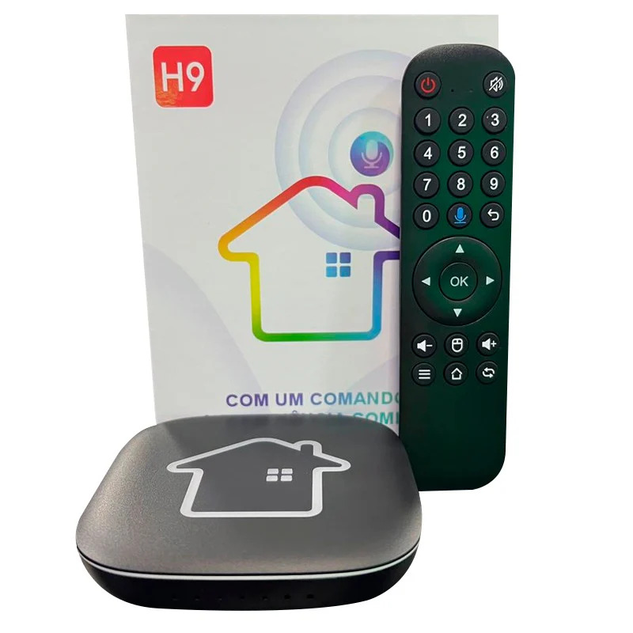

# HTV H9

!!! warning

    The page for this device is incomplete. Be a contributor and help complete this page and many other incomplete pages on the BaseBox Project. Info in this page is not 100% acurrate.

## Device Image

### System Info

--8<-- "includes/android.system.info.md"

## Specifications

| Android Version                              | Chipset         | Rom & Ram    | DroidLogic Based? | GMS Installed | Developer mode acessible? |
| -------------------------------------------- | --------------- | ------------ | ----------------- | ------------- | ------------------------- |
| 14 Upside Down Cake (Unknown Kernel version) | Amlogic S905X5M | 16 GB & 2 GB | ✅                 | ✅             | ✅ (Needs External App)    |

## Enabling Developer mode and Shizuku

This TV Box model disables the conventional method of enabling developer mode (clicking 7 times in Build Number), so, a external app is needed to do this work.

 **We recommend using [this app](../extras/apk/BoxBase_Developer_enabler.apk) to do the job.**

### Shizuku (Untested)

Thecnically, this TV Box model have proper support to setup and run [Shizuku](https://shizuku.rikka.app/).

You can try to setup Shizuku by enabling Wireless ADB and return here to say if it works.

## Known Quircks

- Offers a built-in IPTV app.

- Features a Bluetooth controller and Voice Controls.

- Support for Amazon(R) Alexa(R) integration

- Offers native AI image upscaling

- Base system and apps is similar to UniTV S1 and HTV H8 (Including the IPTV Player)
