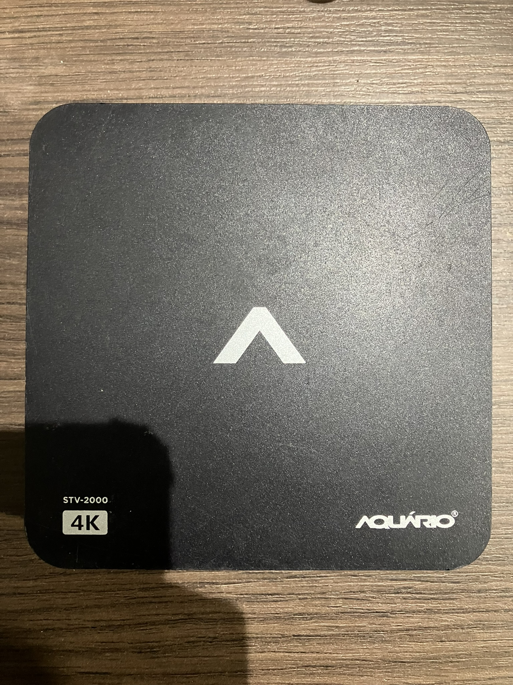
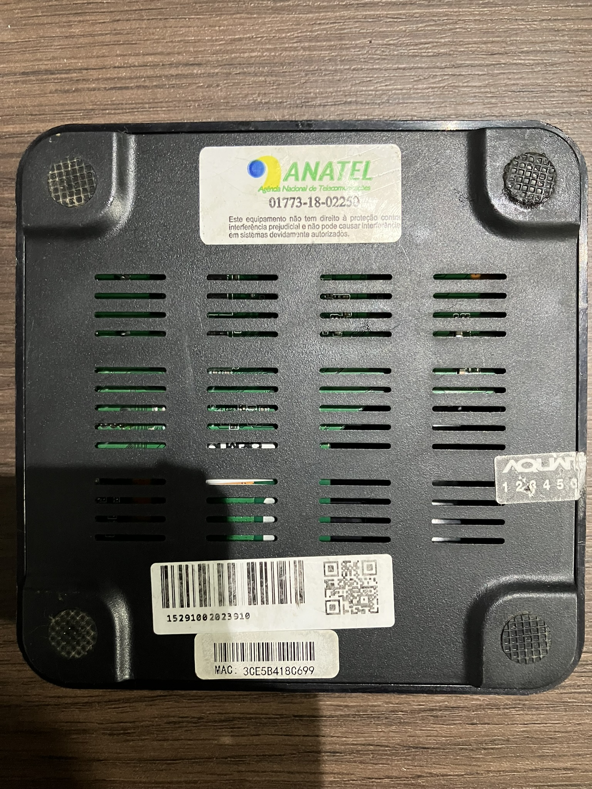
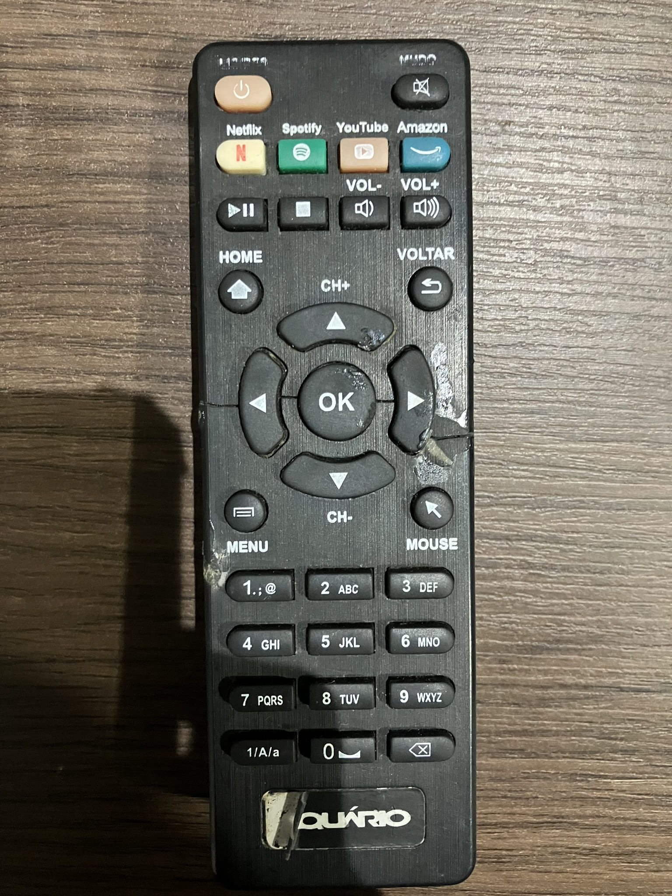
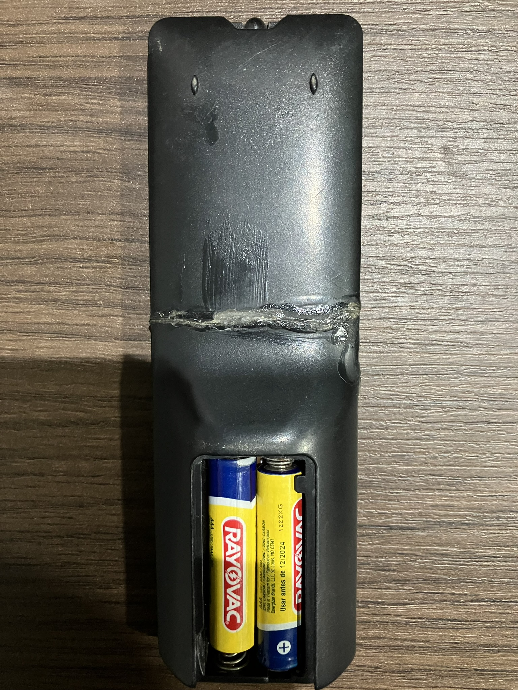

# Aquário STV-2000

## Front

## Back

### System Info

This model have a Android-Based firmware. This allows for further user customization, such as installing apps, modifying the UI, etc.

But also frequently features GMS. Wich is recommended to disable/uninstall. Because most android TV Boxes have very low-end hardware, and Google aims to block apk installing.

## Specifications

| Android Version                       | Chipset       | Rom & Ram  | DroidLogic Based? | GMS Installed | Developer mode acessible? |
| ------------------------------------- | ------------- | ---------- | ----------------- | ------------- | ------------------------- |
| 7.1.2 Nougat (Kernel Version 3.14.29) | Amlogic S905W | 8 GB & 1GB | ✅                 | ✅             | ✅ (Also Root)             |

## Remote Front (Terrible Condition)

## Remote Back (Terrible Condition)

## Enabling Developer mode and Built-in Rooting

This TV Box model does not disable the traditional way of enabling developer mode. So, use the classic route of clicking 7 times in the build number.

!!! note

    Fun Fact:
    This TV Box model features a ROOT MODE SWITCH directly in advanced settings.
    This means that you can do deep customizations in this model, uninstall blotware from the root, and do MUCH MORE!
    But caution. This also heavily compromisses security and can potentialy lead to a soft/hard-brick.

## Known Quircks

- Kernel is based on Ubuntu.

- Low-End hardware suffers from slowness.

- Comes with a bunch of old services and apps installed

- Veeeeeery slow with GMS enabled

- The controler from This Model Sucessor (Aquário STV-3000) is a bit backwards compatible with it.
