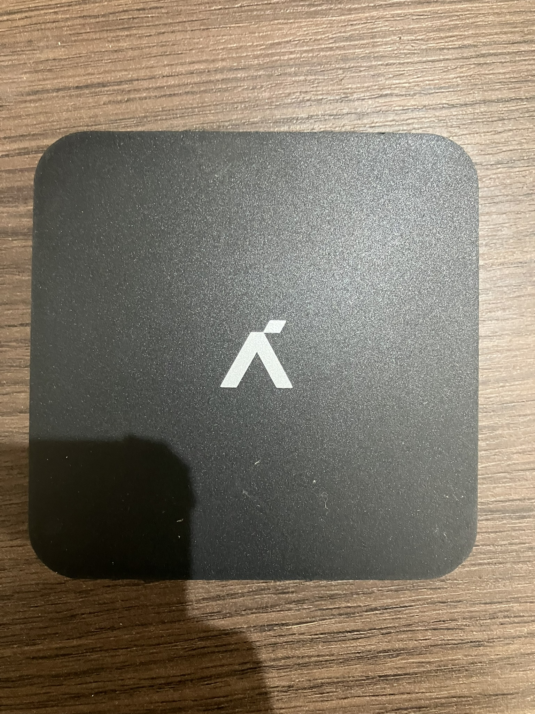
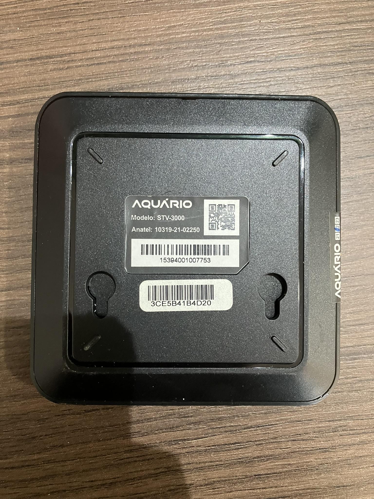
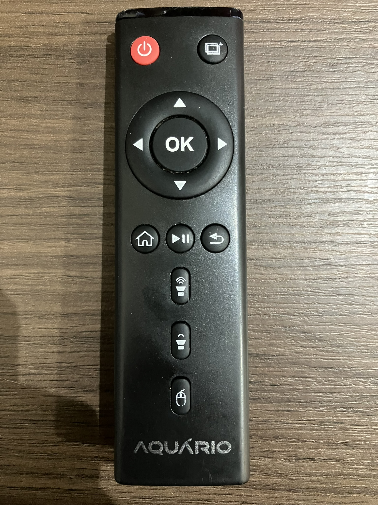
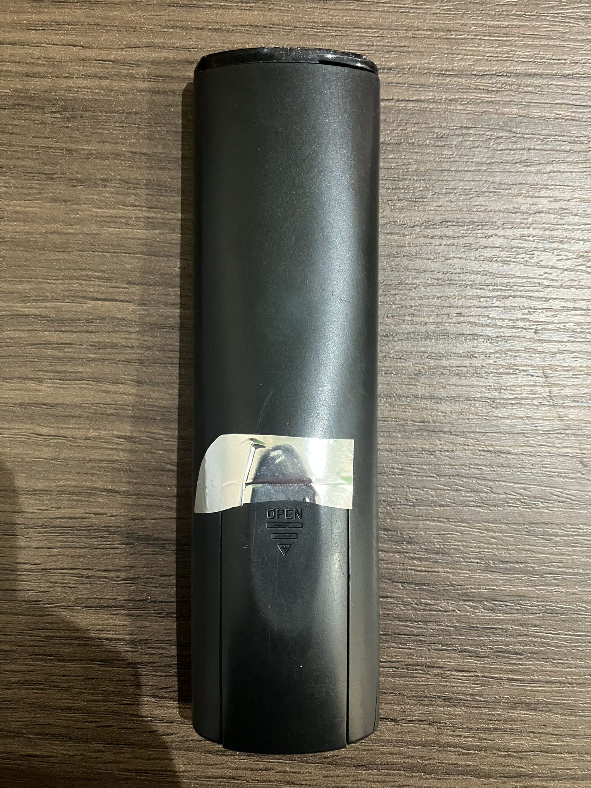

# Aquário STV-3000

## Front

## Back

### System Info

--8<-- "includes/android.system.info.md"

## Specifications

| Android Version                       | Chipset       | Rom & Ram  | DroidLogic Based? | GMS Installed | Developer mode acessible? |
| ------------------------------------- | ------------- | ---------- | ----------------- | ------------- | ------------------------- |
| 7.1.2 Nougat (Kernel Version 3.14.29) | Amlogic S905W | 8 GB & 1GB | ✅                 | ✅             | ✅ (Also Root)             |

## Remote Front

## Remote Back

## Enabling Developer mode and Built-in Rooting

This TV Box model does not disable the traditional way of enabling developer mode. So, use the classic route of clicking 7 times in the build number.

!!! note

    Fun Fact:
    This TV Box model features a ROOT MODE SWITCH directly in advanced settings.
    This means that you can do deep customizations in this model, uninstall blotware from the root, and do MUCH MORE!
    But caution. This also heavily compromisses security and can potentialy lead to a soft/hard-brick.

## Known Quircks

- Kernel is based on Ubuntu.

- Low-End hardware suffers from slowness.

- Has a Thinner and Slimmer look compared to its predecessor (Aquário STV-2000).

- Has the SAME CHIPSET from its predecessor. Performance improvements often came only from the firmware. 
