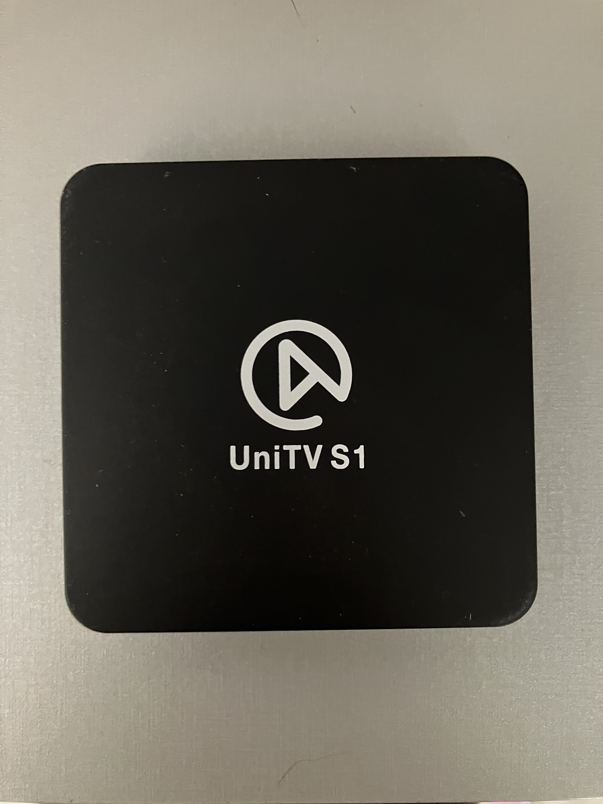
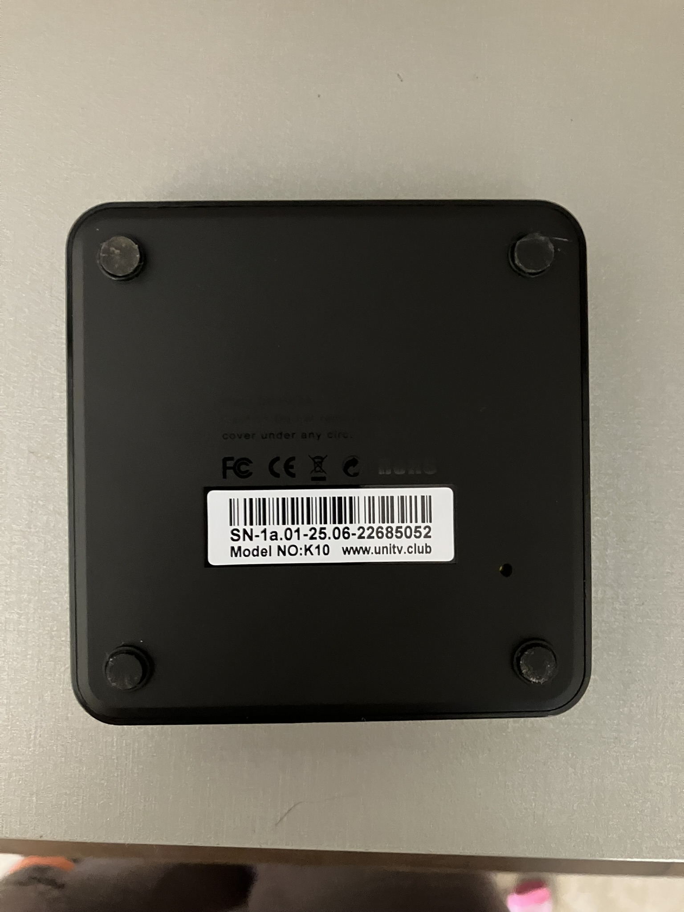
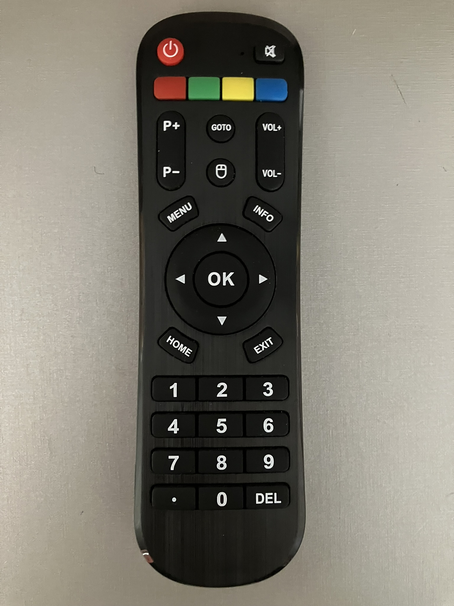
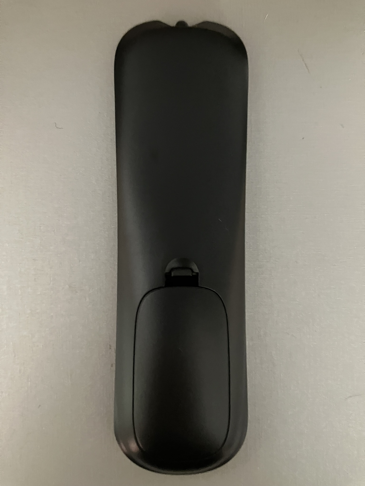

# UniTV S1

## Front

## Back

### System Info

--8<-- "includes/android.system.info.md"

## Specifications

| Android Version                        | Chipset         | Rom & Ram  | DroidLogic Based? | GMS Installed | Developer mode acessible? |
| -------------------------------------- | --------------- | ---------- | ----------------- | ------------- | ------------------------- |
| 7.1.2 Nougat (Kernel Version 3.10.104) | RockChip RK322X | 8 GB & 1GB | ✅                 | ✅             | ✅ (Needs External App)    |

## Remote Front

## Remote Back

## Enabling Developer mode

This TV Box model disables the conventional method of enabling developer mode (clicking 7 times in Build Number), so, a external app is needed to do this work.

 **We recommend using [this app](../extras/apk/BoxBase_Developer_enabler.apk) to do the job.**

## Known Quircks

- Offers a built-in IPTV app.

- Base system and apps is similar to HTV H8 and HTV H9 (Including the IPTV Player)
